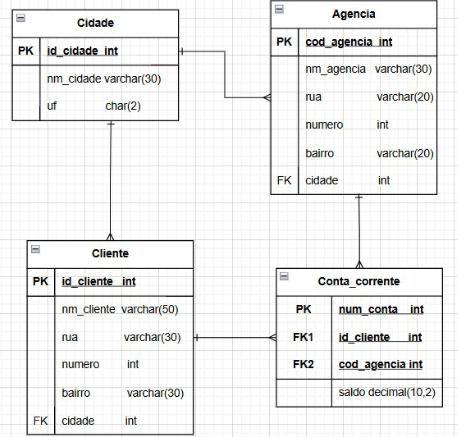

### Instalar Maria DB

```
# Verifica se o winget está instalado
winget --version

# Pesquisa a versão do MariaDB disponível
winget search MariaDB

# Instala a versão 12.0.2.0 especificamente
winget install --id=MariaDB.Server --version 12.0.2.0 --accept-package-agreements --accept-source-agreements

net start MariaDB

"C:\Program Files\MariaDB 12.0\bin\mysqld.exe" --install "MariaDB" --datadir="C:\Program Files\MariaDB 12.0\data"
net start MariaDB
```

### Maria DB
```
cd "C:\Program Files\MariaDB 12.0\bin" # vai ate a pasta

.\mysql.exe -u root -p # roda

net stop MariaDB # para de rodar
```


### Inicializa e mostra bancos disponiveis
```
PS C:\Program Files\MariaDB 12.0\bin> .\mysql.exe -u root -p
Enter password:
Welcome to the MariaDB monitor.  Commands end with ; or \g.
Your MariaDB connection id is 5
Server version: 12.0.2-MariaDB mariadb.org binary distribution

Copyright (c) 2000, 2018, Oracle, MariaDB Corporation Ab and others.

Type 'help;' or '\h' for help. Type '\c' to clear the current input statement.

MariaDB [(none)]> show databases;
+--------------------+
| Database           |
+--------------------+
| information_schema |
| mysql              |
| performance_schema |
| sys                |
+--------------------+
4 rows in set (0.001 sec)

MariaDB [(none)]> create database banco;
Query OK, 1 row affected (0.002 sec)
```
### Mostras bancos
```
MariaDB [(none)]> show databases;
+--------------------+
| Database           |
+--------------------+
| banco              |
| information_schema |
| mysql              |
| performance_schema |
| sys                |
+--------------------+
5 rows in set (0.001 sec)
```
### Usar banco e criar tabela com campos:
```
MariaDB [(none)]> use banco
Database changed
MariaDB [banco]> create table cidade(
    -> id_cidade int primary key auto_increment,
    -> nm_cidade varchar(30),
    -> uf char(2));
Query OK, 0 rows affected (0.010 sec)

MariaDB [banco]>
```
### Fazer outra tabela e sua associação
```
MariaDB [banco]> create table cliente(
    -> id_cliente int primary key auto_increment,
    -> nm_cidade varchar(30),
    -> rua varchar(30),
    -> numero int,
    -> cidade int,
    -> foreign key(cidade) references cidade(id_cidade));
Query OK, 0 rows affected (0.009 sec)
``` 

### Fazer tabela agencia
```
MariaDB [banco]> create table agencia(
    -> cod_agencia int primary key auto_increment,
    -> nm_agencia varchar(30),
    -> rua varchar(20),
    -> numero int,
    -> bairro varchar(20),
    -> cidade int,
    -> foreign key(cidade) references cidade(id_cidade));
Query OK, 0 rows affected (0.010 sec)
```

### Faazer tabela conta corrente
```
 create table conta_corrente(
    -> num_conta int primary key,
    -> id_cliente int,
    -> cod_agencia int,
    -> saldo decimal(10,2),
    -> foreign key(id_cliente) references cliente(id_cliente),
    -> foreign key(cod_agencia) references agencia(cod_agencia));
```

### Mostrar tabelas do banco
```
MariaDB [banco]> show tables;
+-----------------+
| Tables_in_banco |
+-----------------+
| agencia         |
| cidade          |
| cliente         |
| conta_corrente  |
+-----------------+
4 rows in set (0.001 sec)

MariaDB [banco]>
```

### desc para listar propriedade da tabela

```
MariaDB [banco]> show tables;
+-----------------+
| Tables_in_banco |
+-----------------+
| agencia         |
| cidade          |
| cliente         |
| conta_corrente  |
+-----------------+
4 rows in set (0.001 sec)

MariaDB [banco]> desc agencia;
+-------------+-------------+------+-----+---------+----------------+
| Field       | Type        | Null | Key | Default | Extra          |
+-------------+-------------+------+-----+---------+----------------+
| cod_agencia | int(11)     | NO   | PRI | NULL    | auto_increment |
| nm_agencia  | varchar(30) | YES  |     | NULL    |                |
| rua         | varchar(20) | YES  |     | NULL    |                |
| numero      | int(11)     | YES  |     | NULL    |                |
| bairro      | varchar(20) | YES  |     | NULL    |                |
| cidade      | int(11)     | YES  | MUL | NULL    |                |
+-------------+-------------+------+-----+---------+----------------+
6 rows in set (0.021 sec)

MariaDB [banco]> desc cidade;
+-----------+-------------+------+-----+---------+----------------+
| Field     | Type        | Null | Key | Default | Extra          |
+-----------+-------------+------+-----+---------+----------------+
| id_cidade | int(11)     | NO   | PRI | NULL    | auto_increment |
| nm_cidade | varchar(30) | YES  |     | NULL    |                |
| uf        | char(2)     | YES  |     | NULL    |                |
+-----------+-------------+------+-----+---------+----------------+
3 rows in set (0.015 sec)

MariaDB [banco]> desc cliente;
+------------+-------------+------+-----+---------+----------------+
| Field      | Type        | Null | Key | Default | Extra          |
+------------+-------------+------+-----+---------+----------------+
| id_cliente | int(11)     | NO   | PRI | NULL    | auto_increment |
| nm_cidade  | varchar(30) | YES  |     | NULL    |                |
| rua        | varchar(30) | YES  |     | NULL    |                |
| numero     | int(11)     | YES  |     | NULL    |                |
| cidade     | int(11)     | YES  | MUL | NULL    |                |
+------------+-------------+------+-----+---------+----------------+
5 rows in set (0.016 sec)

MariaDB [banco]> desc conta_corrente;
+-------------+---------------+------+-----+---------+-------+
| Field       | Type          | Null | Key | Default | Extra |
+-------------+---------------+------+-----+---------+-------+
| num_conta   | int(11)       | NO   | PRI | NULL    |       |
| id_cliente  | int(11)       | YES  | MUL | NULL    |       |
| cod_agencia | int(11)       | YES  | MUL | NULL    |       |
| saldo       | decimal(10,2) | YES  |     | NULL    |       |
+-------------+---------------+------+-----+---------+-------+
4 rows in set (0.017 sec)

MariaDB [banco]>
```


